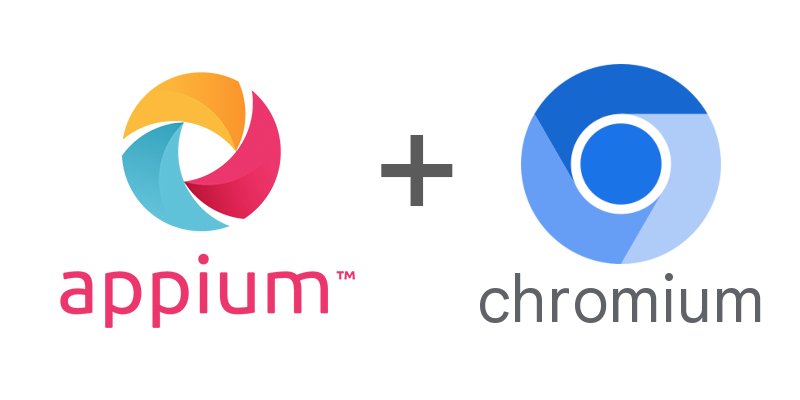

## Appium Chromium Driver

   

---

<b>
   <a href="https://appium.github.io/appium-chromium-driver/">Documentation</a> |
   <a href="https://appium.github.io/appium-chromium-driver/latest/getting-started/">Get Started</a> |
   <a href="https://github.com/appium/appium-chromium-driver/blob/main/CHANGELOG.md">Changelog</a>
</b>

---

This is an Appium driver for automating Chromium-based desktop browsers (such as Google Chrome and Microsoft Edge).

> [!IMPORTANT]
> Since major version *2.0.0*, this driver is only compatible with Appium 3.

## Documentation

You can access the documentation here: [**https://appium.github.io/appium-chromium-driver**](https://appium.github.io/appium-chromium-driver)
